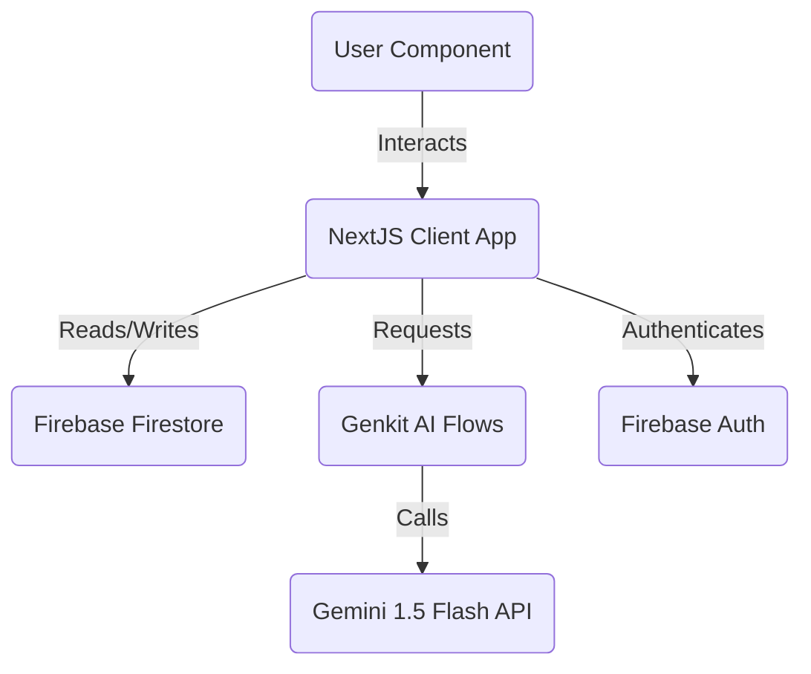

# Architecture

## Architecture Goals

The architecture should be:
- maintainable
- understandable
- scalable according to project constraints
- high performance, modularity, secure client server communication

Avoid unnecessary complexity.

---

# System Overview



---

# Tech Stack

## Frontend
- Framework: NextJS 15 (App Router)
- Styling: Tailwind CSS with Shadcn UI primitives
- State Management: React Context and Local State

## Backend / API
- Framework: NextJS Server Actions and Route Handlers
- Database: Firebase Firestore
- ORM/Query Builder: Firebase SDK

## Infrastructure
- Hosting: Firebase App Hosting
- Deployment: Automated via GitHub integration to Firebase App Hosting

---

# Folder Structure

```
src/
  ai/
    flows/
    tools/
    genkit.ts
  app/
    (auth-routes)/
    about/
    chat/
    contact/
    dashboard/
    games/
    journal/
    login/
    signup/
    survey/
    layout.tsx
    page.tsx
  components/
    games/
    journal/
    layout/
    ui/
  hooks/
  lib/
  services/
```

Each feature module must own its own:
- components
- hooks
- services
- types

Avoid giant shared folders. Maintain a strict Feature Based Architecture.

---

# State Management Rules

Use React Context and Local State.

Do NOT use legacy or unnecessarily complex patterns unless explicitly required.
Keep stores focused. Avoid monolithic state objects.

---

# Data Fetching & Caching

Use Realtime Firestore listeners (onSnapshot) and SDK calls (services).

Responsibilities:
- caching
- invalidation
- async operations

Do not misuse UI state managers for server state patterns.

---

# Authentication

Provider: Firebase Auth

Methods:
- Email and Password
- Password Reset via Email

Authentication state must remain isolated from general application state.

---

# Core Workflows

## Workflow 1: Gratitude Tree Journaling
- User logs a note containing a good or bad thought
- The note is added to Firestore under users/{uid}/notes
- The client UI listens to Firestore updates and rerenders the tree visualization dynamically

## Workflow 2: Tree Spirit Conversation
- User submits a chat message to the Tree AI chat
- The client triggers treeAiChat Genkit flow with user input and the tree name
- Genkit requests a response from Gemini 1.5 Flash using the tree persona prompt
- The response is returned to the client and displayed in the conversation UI

---

# Performance Rules

Use:
- Lazy loading heavy games and visualization components
- Realtime snapshot cleanup on component unmount

Avoid:
- unnecessary rerenders
- unoptimized assets
- Reinitializing Firebase app instances on every server action call

---

# Future Expansion & Scalability

The database schema allows adding global community boards or groups by establishing subcollections under a shared root path in Firestore.
