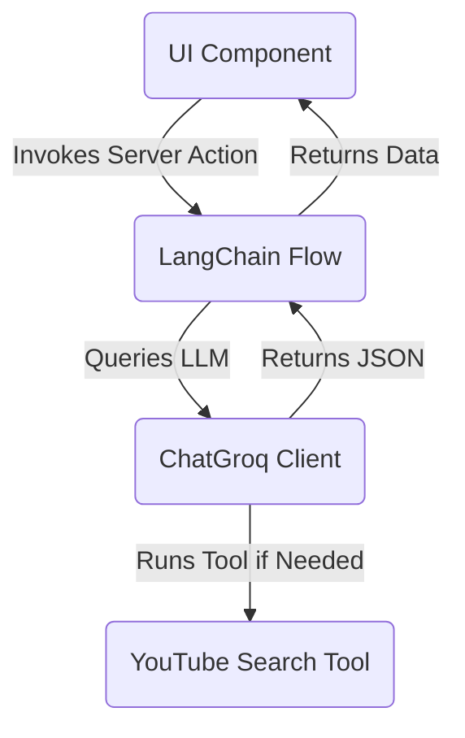

# Specification 0001: Genkit to LangChain Migration

This document outlines the design and plan for migrating the AI layer of MindBloom from Genkit to LangChain using Groq.

## Summary and Requirements

We are removing the dependency on Genkit and replacing it with LangChain. We will use the Groq provider to execute all AI prompts and tools.

### Acceptance Criteria

* Uninstall all genkit dependencies, plugins, and CLI packages.
* Install `@langchain/core` and `@langchain/groq` as the new AI libraries.
* Define a single model instance in a new file `src/ai/llm.ts` to allow easy provider changes.
* Configure `ChatGroq` using the model `llama-3.3-70b-versatile`.
* Use the environment variable `GROQ_API_KEY` for authentication.
* Enforce structured outputs by using the native LangChain method `.withStructuredOutput(zodSchema)`.
* Replace `import { z } from "genkit"` with standard `import { z } from "zod"`.
* Wrap the YouTube search tool as a LangChain `StructuredTool`.
* Preserve all original AI capabilities, prompts, and server action function signatures.
* Ensure the project builds successfully and passes all type checks.

## Step 1: Global Setup

* Verify that the global CSS configuration in `globals.css` and layout in `layout.tsx` are correctly configured. (No changes are needed here as the design system update is already complete).
* Ensure that the `GROQ_API_KEY` environment variable is available in the local environment for testing.

## UI and Architecture

This is a backend architecture migration. The UI components will not change. They will continue to call the same server action functions imported from `src/ai/flows/`.

## Strict Typing and Constants

* We must use standard TypeScript types.
* We must avoid using the `any` type.
* Inputs and outputs for all flows must match the existing schemas in `src/ai/schemas/` and flow files.

## Build Plan

### Phase 1: Dependency Updates
* Install `@langchain/core` and `@langchain/groq`.
* Uninstall `genkit`, `@genkit-ai/googleai`, `@genkit-ai/next`, and `genkit-cli`.

### Phase 2: Core Model Configuration
* Create `src/ai/llm.ts`.
* Initialize and export the `ChatGroq` model instance.
* Set up error handling to return mock structures when `GROQ_API_KEY` is missing or when the API call fails.

### Phase 3: Tool Migration
* Migrate `src/ai/tools/youtube-search.ts` to a LangChain `StructuredTool` using `tool` helper from `@langchain/core/tools`.

### Phase 4: Schema Updates
* Replace all imports of `z` from `genkit` with `z` from `zod` inside `src/ai/schemas/youtube-search.ts`.

### Phase 5: Flow Migrations
* Migrate [tree-ai-chat.ts](file:///workspaces/ahhhhh/src/ai/flows/tree-ai-chat.ts) to use `ChatGroq` with a custom system prompt template.
* Migrate [generate-personalized-recommendations.ts](file:///workspaces/ahhhhh/src/ai/flows/generate-personalized-recommendations.ts) to bind the YouTube search tool and use `.withStructuredOutput`.
* Migrate [search-youtube-videos.ts](file:///workspaces/ahhhhh/src/ai/flows/search-youtube-videos.ts) to call the tool directly.
* Migrate [summarize-resource.ts](file:///workspaces/ahhhhh/src/ai/flows/summarize-resource.ts) to use `ChatGroq` with `.withStructuredOutput`.

### Phase 6: Verification
* Run `npm run build` to verify compilation.
* Ensure no Genkit imports remain in the codebase.
